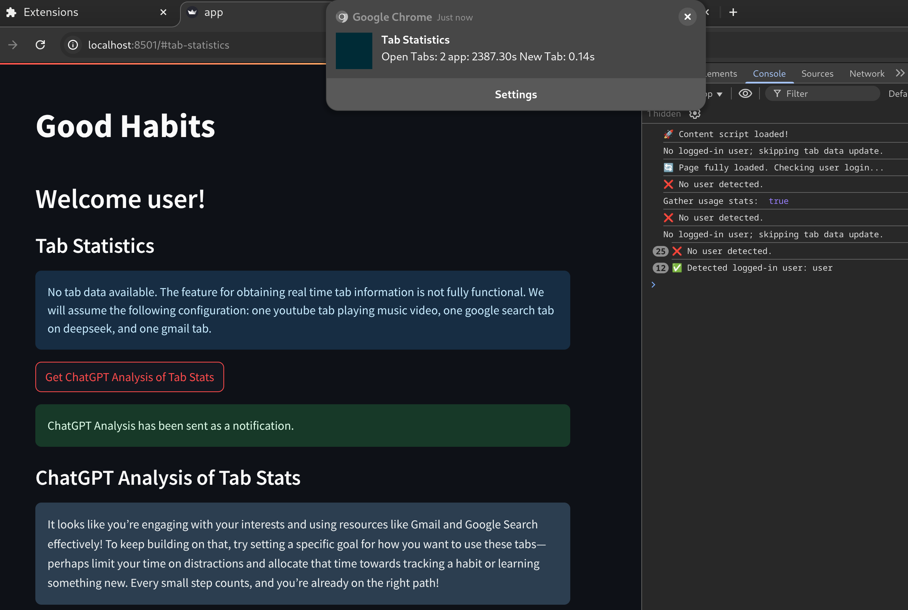

# G00D Habits
HACKNYU 2025

**Inspiration**

We considered apps like Duolingo, which we realized we used frequently due to its fun gamified and interactive experience. We wanted to apply similar principles to habit tracking, making it more than just a to-do list. With G00d-Habits, you will obtain a motivating experience towards greater goals. The generative AI powered notification will give you a personalized experience will keep you reminded, and always give you the support. Are you ready to start making good habits today?

**What it does:** 

G00D-Habits is a web app that helps users build and maintain positive habits. The web app provides a dashboard where users can track their progress and receive AI-generated motivational and helpful messages. User can expect friendly reminders of the habits with different feedback each time (not available at the moment).

**How we built it:**

G00D-Habits has two parts, one is the webapp for user interface, and the other is the Chrome browser extension that checks for browser statistics and gives notifications.

We developed the web app using Streamlit for a simple and effective UI, and using a sqlite database to store user progress and information. We also connected the system to a generative AI model to generate personalized responses and motivational messages based on user habits and progress.

The extension follows the standard procedure of a browser extension using manifest version 2. There is a background service worker for keeping account of the event changes, and updates the database only when there are changes to aiming to improve effciency.

The extension and the web app connects each other through an simple api using flask. However this is the part where we wish to reconsider the intial design choice, becuase using a database make the data transfer more difficult. We attempted to setup the free cloud service on Streamlit, but the service seem to be unresponsive during the start of the hackathon. The notification mechanism also doesn't work as we originally plan due to insufficient developing experiences. These experiences will serve as valuable experiences for us, and we are grate for the sponsors of the different services of this event.

**Accomplishments that we're proud of:**

We successfully built a functional prototype that combines AI-driven habit tracking with gamification. The AI model responses provide meaningful motivation. We also had to design the AI-generated messages to be both engaging and genuinely helpful rather than generic. We're proud of how we managed to create a smooth user experience within 24hrs.

**What we learn:**

We gained hands-on experience integrating AI models into real-world applications. We also learned about data cleanliness by having to manage unwieldy structural differences between development branches. Working across different platforms taught us valuable lessons in coordination in API's.
What's next for Good Habits

**What's next for G00D Habits**

With more time, we would have implement a browser extension using JavaScript to monitor user activity. The browser extension would supplement the sense of accountability by sending notifications and tracking browsing habits. We also would want to possibly have browser extension's capabilities integrated with other productivity tools. Furthermore, we may have include more gamification features, such as progress graphing and competition with other users, as well as deploying the app to other platforms.

**Built With**

Javascript
,Python
,Sqlite
,Streamlit
,Flask
